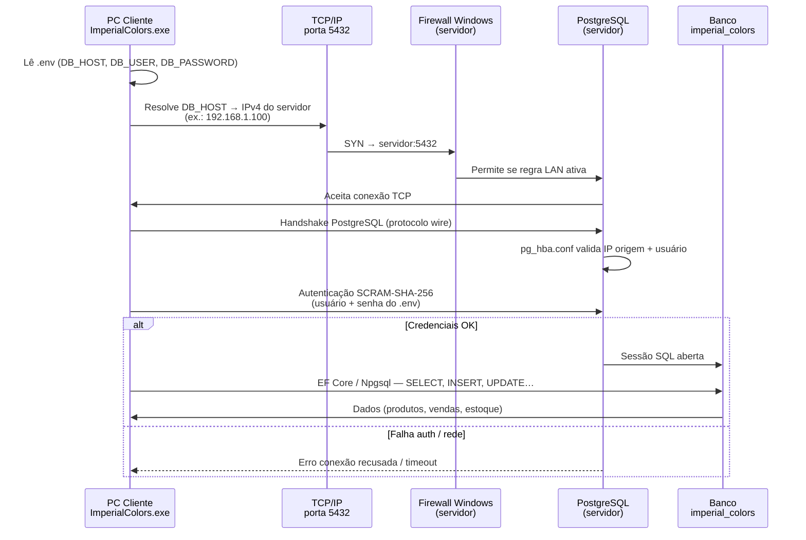

# Imperial Colors - Sistema de Gestão

Sistema de gestão desktop completo para a empresa **Imperial Colors - Tintas e Revestimentos**, desenvolvido com **.NET 10**, **WPF** e **PostgreSQL**.

---

## Tecnologias

| Componente | Tecnologia |
|---|---|
| Linguagem | C# (.NET 10) |
| Interface | WPF (Windows Presentation Foundation) |
| Banco de Dados | PostgreSQL |
| ORM | Entity Framework Core 10 |
| Arquitetura | Clean Architecture |
| PDF | iText 9 |
| Excel | ClosedXML |
| DI | Microsoft.Extensions.Hosting |

---

## Arquitetura do Projeto

```
ImperialColors/
├── src/
│   ├── ImperialColors.Domain/          # Entidades, Interfaces, Enums, Exceções
│   ├── ImperialColors.Application/     # Services, DTOs, Use Cases
│   ├── ImperialColors.Infrastructure/  # EF Core, Repositórios, Migrations
│   └── ImperialColors.UI/              # WPF, Views, ViewModels
├── scripts/                            # Scripts SQL auxiliares
├── docs/                               # Relatórios de testes
├── icons/                              # Logos e ícones
├── .env                                # Credenciais (não commitar)
├── .gitignore
├── ImperialColors.slnx
└── README.md
```

---

## Pré-requisitos

- [.NET 10 SDK](https://dotnet.microsoft.com/download/dotnet/10.0)
- [PostgreSQL 15+](https://www.postgresql.org/download/)
- Windows 10/11 (WPF é exclusivo para Windows)
- Visual Studio 2022+ ou Rider (recomendado)

---

## Instalação e Configuração

### 1. Clonar o repositório

```bash
git clone https://github.com/seu-usuario/imperial-colors.git
cd imperial-colors
```

### 2. Configurar o PostgreSQL

Abra o **pgAdmin** ou **psql** e crie o banco de dados:

```sql
CREATE DATABASE imperial_colors;
CREATE USER imperial_user WITH ENCRYPTED PASSWORD 'SuaSenha123';
GRANT ALL PRIVILEGES ON DATABASE imperial_colors TO imperial_user;
```

### 3. Configurar credenciais (.env)

Copie o arquivo `.env` na raiz do projeto e ajuste os valores:

```env
DB_HOST=localhost
DB_PORT=5432
DB_NAME=imperial_colors
DB_USER=postgres
DB_PASSWORD=SuaSenha
DB_SSL_MODE=Prefer

ADMIN_USERNAME=admin
ADMIN_PASSWORD=Admin@1234
ADMIN_EMAIL=admin@imperialcolors.local
```

> O `.env` é copiado automaticamente para a pasta de saída no build. **Nunca** commite senhas no repositório.

### 3.1 Dados da empresa (appsettings.json)

Os dados exibidos no cupom e cabeçalhos vêm de `src/ImperialColors.UI/appsettings.json` (copiado para a pasta de saída). Edite **sem recompilar** — reinicie o app após alterar:

```json
"DadosEmpresa": {
  "NomeFantasia": "Imperial Colors",
  "RazaoSocial": "Imperial Colors Tintas e Revestimentos LTDA",
  "Subtitulo": "Tintas e Revestimentos",
  "CNPJ": "00.000.000/0001-00",
  "Endereco": "Rua das Tintas, nº 100 - Bairro Centro, Curitiba - PR",
  "Telefone": "(41) 99999-9999"
}
```

Variáveis de ambiente (`.env`) sobrescrevem o JSON: `EMPRESA_NOME`, `EMPRESA_CNPJ`, `EMPRESA_ENDERECO`, `EMPRESA_TELEFONE`, etc.

### 4. Executar as Migrations

```bash
cd imperial-colors
dotnet ef migrations add InitialCreate --project src/ImperialColors.Infrastructure --startup-project src/ImperialColors.Infrastructure
dotnet ef database update --project src/ImperialColors.Infrastructure --startup-project src/ImperialColors.Infrastructure
```

> **Nota:** O sistema aplica as migrations automaticamente ao iniciar. Se preferir, execute manualmente com os comandos acima.

### 5. Executar a aplicação

```bash
dotnet run --project src/ImperialColors.UI
```

Ou abra `ImperialColors.slnx` no Visual Studio e pressione **F5**.

---

## Autenticação e Usuários

### Login inicial (administrador)

Na primeira execução, o sistema cria (ou garante) o usuário admin definido no `.env`:

| Campo | Valor padrão |
|---|---|
| Usuário | `admin` |
| Senha | `Admin@1234` |

### Cadastro de novos usuários

1. Na tela de login, aba **Cadastrar**
2. Após o cadastro, a conta fica com status **Aguardando aprovação**
3. Um administrador aprova em **Configurações → Gestão de Usuários**

### Valores de status no banco (`usuarios.status`)

| Valor | Significado |
|---|---|
| `1` | Aguardando aprovação (não pode entrar) |
| `2` | Aprovado (pode entrar) |
| `3` | Cancelado |

Para aprovar manualmente via SQL, use `scripts/aprovar_usuario.sql`:

```sql
UPDATE usuarios SET status = 2 WHERE username = 'seu_usuario';
```

### Recuperar senha do admin

No `.env`, defina temporariamente:

```env
ADMIN_RESET_PASSWORD=true
```

Reinicie o app. A senha do `ADMIN_USERNAME` será redefinida para `ADMIN_PASSWORD`. Remova ou comente a linha depois.

---

## Configuração em Dois ou Mais Computadores (Rede Local)

O Imperial Colors foi projetado para que **vários computadores** (balcões, PDV, escritório) acessem o **mesmo banco de dados** ao mesmo tempo. Todos enxergam produtos, estoque e vendas em tempo real.

### Como funciona (visão geral)

```
┌─────────────────────────────┐         ┌─────────────────────────────┐
│   PC SERVIDOR               │         │   PC CLIENTE (PDV 2, etc.)  │
│                             │         │                             │
│  PostgreSQL  ◄── banco ──►  │  rede   │  ImperialColors.exe         │
│  ImperialColors.exe         │ ◄─────► │  (sem PostgreSQL)           │
│  (opcional: PDV 1 aqui)     │  local  │                             │
└─────────────────────────────┘         └─────────────────────────────┘
         ▲                                         │
         │                                         │
         └─────────── mesmo Wi‑Fi / cabo ─────────┘
```

| Papel | O que instalar | O que configurar |
|-------|----------------|------------------|
| **PC Servidor** | PostgreSQL + Imperial Colors | Banco de dados + `.env` com `DB_HOST=localhost` |
| **Demais PCs** | Somente Imperial Colors | `.env` com `DB_HOST=<IP do servidor>` |

> **Importante:** a conexão com o banco é feita pelo arquivo **`.env`** (na pasta do `ImperialColors.exe`), **não** pelo `appsettings.json`. O `appsettings.json` serve para dados da empresa no cupom (nome, CNPJ, endereço).

---

### Passo 0 — Descobrir o IP do computador SERVIDOR

Os outros PCs precisam do **IPv4 da rede local** do servidor — **não** use `localhost` nem `127.0.0.1` neles.

#### Método 1 — PowerShell ou Prompt (recomendado)

No **PC onde o PostgreSQL ficará instalado**, abra o PowerShell e execute:

```powershell
ipconfig
```

Procure o adaptador que está **em uso**:

| Adaptador | Quando usar |
|-----------|-------------|
| **Ethernet** / **Cabo** | PC conectado por cabo de rede |
| **Wi‑Fi** / **Wireless** | PC conectado sem fio |

Anote o valor **Endereço IPv4**, por exemplo:

```
Adaptador de Rede sem Fio Wi-Fi:
   Endereço IPv4. . . . . . . . : 192.168.1.100
```

Neste exemplo, **`192.168.1.100`** é o IP que os outros computadores devem usar em `DB_HOST`.

#### Método 2 — Interface gráfica do Windows

1. **Configurações** → **Rede e Internet**
2. Clique na rede ativa (**Wi‑Fi** ou **Ethernet**)
3. Role até **Propriedades** → anote o **Endereço IPv4**

#### Método 3 — Comando direto (PowerShell)

```powershell
Get-NetIPAddress -AddressFamily IPv4 |
  Where-Object { $_.InterfaceAlias -notmatch 'Loopback' -and $_.IPAddress -notlike '169.254.*' } |
  Select-Object InterfaceAlias, IPAddress
```

Ignore endereços `169.254.x.x` (link local — indica problema de rede/DHCP).

#### Qual IP **não** usar

| Valor | Por quê |
|-------|---------|
| `127.0.0.1` / `localhost` | Só funciona **no próprio PC**; nos clientes causa erro de conexão |
| IP público do roteador | Não serve para rede interna da loja |
| IPv6 (ex.: `fe80::...`) | Use sempre o **IPv4** (ex.: `192.168.x.x`) |

> O IP local pode **mudar** se o roteador reatribuir endereços (DHCP). Para produção, configure **IP fixo** no servidor ou **reserva de DHCP** no roteador (sempre o mesmo MAC → mesmo IP).

---

### Passo 1 — Preparar o PC SERVIDOR (PostgreSQL)

#### 1.1 Instalar PostgreSQL

Instale o [PostgreSQL 15+](https://www.postgresql.org/download/windows/) neste computador e crie o banco:

```sql
CREATE DATABASE imperial_colors;
```

Anote o usuário e a senha definidos na instalação (ex.: usuário `postgres`).

#### 1.2 Permitir conexões de outros PCs na rede

Edite `postgresql.conf` (geralmente em `C:\Program Files\PostgreSQL\16\data\`):

```conf
listen_addresses = '*'
```

Edite `pg_hba.conf` (mesmo diretório). Adicione **no final** uma linha para a faixa da sua rede:

```conf
# Formato: host  BANCO  USUARIO  FAIXA_DE_IP/MASCARA  METODO

host    imperial_colors    postgres    192.168.1.0/24    scram-sha-256
```

**Como saber a faixa (`/24`)?**

| Se o IP do servidor for… | Use no `pg_hba.conf` |
|--------------------------|----------------------|
| `192.168.1.100` | `192.168.1.0/24` |
| `192.168.0.50` | `192.168.0.0/24` |
| `10.0.0.15` | `10.0.0.0/24` |

O `/24` libera todos os IPs da mesma sub-rede (ex.: `192.168.1.1` até `192.168.1.254`).

#### 1.3 Reiniciar o PostgreSQL

```powershell
# PowerShell como Administrador — ajuste o número da versão se necessário:
Restart-Service postgresql-x64-16
```

Para listar o nome exato do serviço:

```powershell
Get-Service *postgres*
```

#### 1.4 Liberar a porta 5432 no Firewall do Windows

```powershell
# PowerShell como Administrador:
New-NetFirewallRule -DisplayName "PostgreSQL Imperial Colors" `
  -Direction Inbound -Protocol TCP -LocalPort 5432 -Action Allow
```

#### 1.5 Configurar o `.env` no SERVIDOR

Na pasta do executável (`ImperialColors.exe`), edite o `.env`:

```env
DB_HOST=localhost
DB_PORT=5432
DB_NAME=imperial_colors
DB_USER=postgres
DB_PASSWORD=SuaSenhaDoPostgreSQL
DB_SSL_MODE=Prefer

ADMIN_USERNAME=admin
ADMIN_PASSWORD=SenhaSegura@2026
ADMIN_EMAIL=admin@imperialcolors.local
```

#### 1.6 Primeira execução (somente no servidor)

Execute `ImperialColors.exe` **uma vez** neste PC. O sistema:

- Cria/atualiza as tabelas (migrations automáticas)
- Cria o usuário administrador definido no `.env`

Depois disso, os demais PCs podem conectar ao mesmo banco.

---

### Passo 2 — Configurar os PCs CLIENTES (2º, 3º, 4º…)

Instale **apenas** o Imperial Colors (mesmo pacote ZIP/publicação). **Não** instale PostgreSQL nestes PCs.

#### 2.1 Editar o `.env` de cada cliente

Copie o `.env` do servidor e altere **apenas** `DB_HOST`:

```env
# Troque 192.168.1.100 pelo IPv4 REAL do servidor (Passo 0)
DB_HOST=192.168.1.100
DB_PORT=5432
DB_NAME=imperial_colors
DB_USER=postgres
DB_PASSWORD=SuaSenhaDoPostgreSQL
DB_SSL_MODE=Prefer
```

| Campo | Servidor | Clientes |
|-------|----------|----------|
| `DB_HOST` | `localhost` | **IP do servidor** (ex.: `192.168.1.100`) |
| `DB_PORT` | `5432` | `5432` (igual) |
| `DB_NAME` | `imperial_colors` | `imperial_colors` (igual) |
| `DB_USER` / `DB_PASSWORD` | credenciais do PostgreSQL | **as mesmas** do servidor |

> Cada PDV pode ter impressora diferente (configure em **Configurações → Periféricos**). O banco é compartilhado; periféricos são locais de cada máquina.

#### 2.2 Testar se o cliente alcança o servidor

No **PC cliente**, abra o PowerShell (substitua pelo IP anotado no Passo 0):

```powershell
Test-NetConnection -ComputerName 192.168.1.100 -Port 5432
```

| Resultado | Significado |
|-----------|-------------|
| `TcpTestSucceeded : True` | Rede OK — pode abrir o Imperial Colors |
| `TcpTestSucceeded : False` | Firewall, IP errado ou PostgreSQL parado — veja [Troubleshooting](#erro-em-rede-local-connection-refused) |

#### 2.3 Abrir o sistema e validar

1. Execute `ImperialColors.exe`
2. Faça login (ex.: `admin` / senha do `.env`)
3. Em **Configurações**, use **Testar Conexão** para confirmar o banco
4. Cadastre um produto no servidor e verifique se aparece no cliente (e vice-versa)

---

### Exemplo completo — Loja com 2 PDVs

| Máquina | IP local | PostgreSQL | `DB_HOST` no `.env` |
|---------|----------|------------|---------------------|
| Caixa 1 (servidor) | `192.168.1.100` | Sim | `localhost` |
| Caixa 2 | `192.168.1.101` | Não | `192.168.1.100` |

Ambos na **mesma rede** (mesmo roteador/switch). Caixa 2 aponta para o IP do Caixa 1.

---

### Exemplo — Loja com 3 ou mais computadores

| Máquina | Função | `DB_HOST` |
|---------|--------|-----------|
| PC A (`192.168.1.100`) | Servidor + PDV | `localhost` |
| PC B (`192.168.1.101`) | PDV | `192.168.1.100` |
| PC C (`192.168.1.102`) | Escritório / estoque | `192.168.1.100` |

Regra única: **todos os clientes** usam o IP do PC onde o PostgreSQL está instalado.

---

### Checklist rápido (antes de ir para produção)

- [ ] PostgreSQL instalado e rodando **apenas no servidor**
- [ ] IP IPv4 do servidor anotado (`ipconfig`)
- [ ] `listen_addresses = '*'` no `postgresql.conf`
- [ ] Regra no `pg_hba.conf` com a faixa correta (`192.168.x.0/24`)
- [ ] Firewall liberou a porta **5432** no servidor
- [ ] `Test-NetConnection` retorna `True` em **cada** PC cliente
- [ ] `.env` do servidor: `DB_HOST=localhost`
- [ ] `.env` dos clientes: `DB_HOST=<IP do servidor>`
- [ ] Imperial Colors aberto **primeiro no servidor** (migrations + admin)
- [ ] Teste de conexão OK em **Configurações** em cada máquina
- [ ] **IP fixo ou reserva DHCP** no servidor (evita quebra quando a rede reinicia)

---

### Segurança: liberar a porta TCP 5432 é vulnerável?

**Resposta curta:** abrir a porta **no firewall do PC servidor** para a **rede local da loja** é **necessário** para os PDVs funcionarem, mas **não deve** ser exposta à **internet pública**.

| Cenário | Risco | Recomendação |
|---------|-------|--------------|
| Porta 5432 aberta **só na LAN** (`192.168.x.x`) | **Baixo a moderado** — qualquer dispositivo na mesma Wi‑Fi/cabo pode *tentar* conectar | Aceitável em loja **se** PostgreSQL exige senha forte + `pg_hba.conf` restrito |
| Porta 5432 **encaminhada no roteador** (port forwarding) para a internet | **Alto** — bots varrem PostgreSQL exposto 24h | **Nunca faça isso** |
| PostgreSQL sem senha ou senha fraca | **Crítico** | Senha longa; usuário dedicado (não `postgres` genérico em produção, se possível) |
| `pg_hba.conf` com `0.0.0.0/0` | **Alto** — aceita qualquer origem | Use apenas a faixa da loja (`192.168.1.0/24`) |

**O que a regra de firewall faz**

```
Internet ──X──► Roteador ──X──► Porta 5432   (ideal: NÃO expor)
                         │
                         └──► LAN 192.168.1.0/24 ──► PC Servidor:5432  (PDVs da loja)
```

A regra `New-NetFirewallRule ... -LocalPort 5432` no **Windows do servidor** libera entrada **naquele PC**, em geral para **qualquer origem que alcance a máquina** (incluindo a LAN). Ela **não** publica o banco na internet por si só — isso só ocorre se o **roteador** fizer redirecionamento de porta.

**Camadas de proteção recomendadas (do mais importante ao complementar)**

1. **PostgreSQL escuta apenas a rede local** — `listen_addresses = '*'` escuta todas as interfaces *do PC*; combine com firewall do Windows limitando origem (regra avançada por subnet) ou garanta que o roteador **não** faça NAT da 5432.
2. **`pg_hba.conf` restrito** — permita só `192.168.1.0/24` (ou a faixa real da loja), banco `imperial_colors`, usuário específico, `scram-sha-256`.
3. **Senha forte** no `.env` (`DB_PASSWORD`) — trate como credencial de produção.
4. **Rede Wi‑Fi da loja com senha (WPA2/WPA3)** — evita que visitantes na mesma rede tentem acessar o banco.
5. **Separar rede de visitantes** (SSID convidado isolado) — ideal se o roteador suportar VLAN/convidado.
6. **Backups** — se alguém na LAN comprometer credenciais, backup recente limita o dano.

> **Conclusão:** na prática de uma loja com 2+ PDVs, abrir **5432/TCP no servidor para a LAN** é o procedimento padrão. O risco relevante aparece quando a porta fica **acessível de fora** ou quando **autenticação/rede** são fracas — não pelo fato de existir regra de firewall interna.

**Firewall mais restrito (opcional — PowerShell como Administrador)**

Libera 5432 **apenas** da sub-rede local (ajuste o IP):

```powershell
New-NetFirewallRule -DisplayName "PostgreSQL Imperial Colors (LAN)" `
  -Direction Inbound -Protocol TCP -LocalPort 5432 -Action Allow `
  -RemoteAddress 192.168.1.0/24
```

---

### Fluxograma da conexão (protocolos e camadas)



**Resumo dos protocolos**

| Camada | Tecnologia | Função |
|--------|------------|--------|
| Aplicação | Imperial Colors (WPF) + EF Core | Telas, regras de negócio |
| Driver | **Npgsql** | Traduz operações .NET → protocolo PostgreSQL |
| Sessão / auth | **PostgreSQL wire protocol** + **SCRAM-SHA-256** | Login seguro com senha |
| Transporte | **TCP** | Conexão confiável ponto a ponto |
| Rede | **IPv4** (ex.: `192.168.1.x`) | Endereçamento na LAN |
| Enlace | Ethernet ou **Wi‑Fi (802.11)** | Cabo ou sem fio até o roteador |

**Fluxo simplificado (visão operacional)**

```
[ PDV Cliente ]                    [ PC Servidor ]
ImperialColors.exe                      PostgreSQL :5432
       │                                       ▲
       │  .env → DB_HOST=192.168.1.100         │
       └──────── TCP 5432 ── LAN ──────────────┘
              (Npgsql + senha SCRAM)
```

---

### IP que muda após reinício ou queda de rede (DHCP)

**Sim, isso acontece em cabo e Wi‑Fi.** Se o roteador usa **DHCP** (padrão em quase toda rede doméstica/comercial), o IPv4 é **emprestado** por um tempo (lease). Ao reiniciar o PC, trocar de cabo/Wi‑Fi ou o roteador reiniciar, o servidor pode receber **outro IP** (ex.: era `.100`, virou `.105`). Os PDVs com `.env` fixo em `.100` **param de conectar**.

| Causa comum | Cabo | Wi‑Fi |
|-------------|------|-------|
| Reinício do PC | Pode mudar IP | Pode mudar IP |
| Reinício do roteador | Pode mudar IP | Pode mudar IP |
| Queda prolongada de energia/rede | Pode mudar IP | Pode mudar IP |
| Trocar de roteador | Quase sempre muda faixa/IP | Idem |

#### Soluções recomendadas (ordem de preferência)

**1. Reserva DHCP no roteador (melhor custo/benefício)**

No painel do roteador (geralmente `192.168.1.1` ou `192.168.0.1`):

1. Identifique o **MAC Address** da placa de rede do **PC servidor** (`ipconfig /all` → Endereço Físico).
2. Crie **Reserva DHCP / IP fixo por MAC**: sempre `192.168.1.100` → MAC do servidor.
3. Os clientes mantêm `DB_HOST=192.168.1.100` **para sempre** (enquanto o roteador não mudar).

**2. IP estático no Windows (servidor)**

Configurações → Rede → Ethernet/Wi‑Fi → Editar IP → **Manual**:

- IP: `192.168.1.100`
- Máscara: `255.255.255.0`
- Gateway: IP do roteador (ex.: `192.168.1.1`)
- DNS: gateway ou `8.8.8.8`

Use um IP **fora** do pool DHCP do roteador ou combine com reserva DHCP para evitar conflito.

**3. Nome do host em vez de IP (alternativa)**

No `.env` dos clientes, o Npgsql aceita hostname:

```env
DB_HOST=IMPERIAL-SERVIDOR
```

Para funcionar na LAN:

- **Opção A:** arquivo `C:\Windows\System32\drivers\etc\hosts` em **cada cliente**:

  ```
  192.168.1.100    IMPERIAL-SERVIDOR
  ```

- **Opção B:** nome NetBIOS do Windows do servidor (menos confiável em todas as redes).

Se o IP do servidor mudar, atualiza-se **só o `hosts` do servidor** (ou a reserva DHCP) — o `.env` dos PDVs permanece `DB_HOST=IMPERIAL-SERVIDOR`.

#### Atualizar o IP “automaticamente” a cada boot — por que **não** é a melhor ideia

| Abordagem automática | Problema |
|---------------------|----------|
| App escaneia a rede e “adivinha” o servidor | Pode apontar para o PC errado; lento; falha com firewalls |
| App reescreve `.env` sozinho | Risco de corromper config; difícil auditar; comportamento imprevisível |
| Depender do IP que “aparecer” no Wi‑Fi | Vários dispositivos PostgreSQL ou IPs temporários geram caos |

**Recomendação profissional:** estabilize o IP na **infraestrutura** (reserva DHCP ou IP estático no **servidor**), não no aplicativo. É o padrão em ERP, PDV e sistemas corporativos.

> O Imperial Colors **não** altera o `.env` automaticamente hoje — isso é intencional para previsibilidade e segurança. A correção correta é **fixar o endereço do servidor na rede**, não reconfigurar todos os PDVs quando o DHCP mudar.

#### Se o IP mudou e os PDVs pararam (procedimento de emergência)

1. No **servidor**, rode `ipconfig` e anote o **novo** IPv4.
2. Em **cada cliente**, edite `.env`: `DB_HOST=<novo_ip>`.
3. Reinicie o Imperial Colors.
4. Depois, aplique **reserva DHCP** ou **IP estático** para não repetir o problema.

---

### Dashboard
- Total de vendas do dia e do mês
- Alertas de estoque baixo e zerado
- Top 3 produtos mais vendidos
- Resumo financeiro e últimas vendas

### Estoque
- Cadastro completo de produtos (código interno, código de barras, categoria, marca, etc.)
- **Filtro "Apenas em Promoção"** — checkbox na listagem que exibe somente produtos com preço promocional ativo e menor que o preço de venda
- Controle de movimentações (entrada, saída, ajuste)
- Alertas de estoque baixo
- Busca por nome, código interno ou código de barras
- Suporte a leitura de código de barras (conecte o leitor USB e use no campo de busca)
- Produto não encontrado: campo limpo automaticamente com alerta sonoro e mensagem em vermelho
- **Unidades de Medida suportadas:** UN, GL (Galão), BD (Balde), LT (Litro), RL (Rolo), CX (Caixa), PCT (Pacote)
- **Galão (GL):** ao selecionar GL, o campo **Litragem** aparece automaticamente com opções **3,6L** ou **18L** — salvo na coluna `litragem_gl` do banco e exibido no estoque e PDV (ex: `Tinta Coral (GL 18L)`)
- **Balde (BD):** nova unidade para tintas vendidas em balde, disponível em todo o sistema

### PDV - Ponto de Venda
- Atalho no menu: **PDV - Nova venda (F2)**
- Interface rápida para vendas
- Busca de produtos por nome, código ou código de barras
- Leitor de código de barras: produto inexistente limpa o campo na hora (alerta sonoro + mensagem vermelha)
- Cálculo automático de totais
- Aplicação de descontos
- **Modal de fechamento** com formas de pagamento:
  - Dinheiro (valor recebido + troco automático)
  - Cartão Débito / Crédito (1x a 12x) / Pix / Boleto
- Atualização automática do estoque ao confirmar venda

### Histórico de Vendas
- Listagem paginada com filtro por período (coluna **Cliente** removida da grid; busca por nome de cliente ainda funciona)
- Botão **Registrar Devolução** cancela vendas finalizadas e repõe estoque automaticamente (transação no PostgreSQL)
- Botão **Registrar Troca** — módulo profissional de troca de produtos:
  - **Etapa 1 – Item Devolvido:** selecione o produto da venda original e a quantidade devolvida
  - **Checkbox:** "Retornar item devolvido para o estoque físico?" (para latas lacradas/não abertas)
  - **Etapa 2 – Novo Item:** busca de produto por nome, código ou código de barras
  - **Etapa 3 – Resumo Financeiro:** cálculo em tempo real da diferença
    - Troca idêntica → `Troca Idêntica`
    - Novo mais caro → `Diferença a Receber: R$ X` com seleção de forma de pagamento (Pix, Dinheiro, Débito, Crédito)
    - Novo mais barato → `Diferença a Devolver: R$ Y`
  - Toda a operação roda em uma única `IDbContextTransaction` — se qualquer etapa falhar, nada é salvo
  - Movimentações de estoque registradas automaticamente com rastreabilidade (`Troca vinculada à Venda ID X`)
- Impressão/visualização de cupom

### Vendas Externas
- Menu lateral **Vendas externas** (ícone 🚚), posicionado logo abaixo de **Vendas**
- Consolida vendas realizadas fora do estabelecimento físico
- **Fluxo A – Produto cadastrado:** busca por código de barras ou texto; preenche nome e preço base; informa quantidade e valor praticado na rua; ao concluir, dá baixa automática no estoque
- **Fluxo B – Item manual:** nome, quantidade e valor unitário livres, sem vínculo com produto — computado apenas no faturamento, sem baixa de estoque
- **Importador TXT:** formato `CODIGO_DE_BARRAS;NOME_DO_PRODUTO;QUANTIDADE` — grade de conferência editável antes da aprovação
- Botão **Aprovar e Concluir Venda** grava venda + baixas em uma única transação (`IDbContextTransaction`); falha de estoque ou validação faz rollback completo
- **Pós-venda (gerenciamento completo):**
  - **Editar:** reabre a grade de itens; altere quantidades, preços ou adicione novos itens — o estoque é recalculado automaticamente (aumento baixa diferença, redução repõe diferença; itens manuais só afetam faturamento)
  - **Excluir:** hard delete com confirmação; repõe integralmente o estoque dos produtos vinculados antes de remover a venda do PostgreSQL
  - **Registrar Troca:** modal em 3 etapas (Item Devolvido → Novo Item → Diferença Financeira), igual ao PDV, com checkbox opcional de retorno ao estoque
- Todas as operações que alteram estoque (editar, excluir, trocar) rodam em `IDbContextTransaction` com rollback automático em caso de falha
- Número da venda: `EXT-yyyyMMdd-0001`
- Tabelas PostgreSQL: `vendas_externas`, `itens_venda_externa`; movimentações de estoque vinculadas via `venda_externa_id`

### Clientes
- Cadastro completo (nome, CPF, contatos, endereço com ViaCEP)
- Campo **E-mail** com validação em tempo real (`InputSanitizer.EmailValido`) — opcional, mas deve ser válido se preenchido
- Busca rápida e paginação
- Acesso pelo menu **Clientes** (`Views/ClientesView.xaml`)
- Vinculação opcional com vendas no PDV

### Cupom Não Fiscal
- Gerado automaticamente após cada venda
- Exibe forma de pagamento, parcelas e troco (quando aplicável)
- Impressão direta na impressora configurada em Periféricos
- Opções: imprimir, visualizar, salvar PDF

### Mercadorias / Fornecedores
- Acesse pelo menu **Mercadorias**
- **Aba Fornecedores:** cadastro de fornecedores (CNPJ, CEP, contatos)
- **Aba Listas de Compra:** monte listas de produtos para comprar, marque itens comprados e finalize a lista
  - **Anexar Nota da Compra:** selecione PDF ou imagem (PNG/JPG) via assistente do Windows; o arquivo é convertido em `byte[]` e salvo na coluna `BYTEA` (`nota_fiscal_conteudo`) do PostgreSQL — centralizado e protegido no banco
  - **Visualizar Nota:** extrai os bytes do banco e abre no visualizador padrão do Windows (habilitado somente quando há anexo)
  - Coluna **Nota NF** na grid indica se a lista possui nota anexada

### Relatórios
- Vendas por período (PDF e Excel)
- **Relatório Consolidado de Vendas (Geral)** — unifica vendas de balcão (PDV) e vendas externas com coluna **Origem** (`Balcão` / `Externa`); exportação PDF e Excel
- **Relatório de Vendas Externas** — auditoria item a item das vendas de rua (filtro por período)
- **Análise de Giro e Desempenho de Produtos** — três visões com exportação PDF/Excel:
  - **Mais Vendidos** — ranking por volume (balcão + vendas externas)
  - **Menos Vendidos** — itens com saída no período, ordenados do menor para o maior
  - **Nunca Vendidos (Encalhados)** — produtos com estoque e zero vendas no intervalo
- Estoque completo (PDF e Excel)
- Produtos com estoque baixo
- Produtos sem estoque

### Backup Automático Híbrido
- Disparo silencioso na abertura da `MainWindow` (após login), em `Task.Run` — **não bloqueia** login, menu ou PDV
- Verifica `DataUltimoBackup` na tabela PostgreSQL `parametros_sistema` (chave `DataUltimoBackup`)
- Executa backup se nunca rodou ou se passaram **≥ 7 dias** (`BACKUP_INTERVALO_DIAS` no `.env`)
- Destino padrão: `C:\backup_sistema\{mes-ano}\{dd-MM-yyyy}\` (ex.: `C:\backup_sistema\junho-2026\20-06-2026\`)
- Conteúdo do backup diário:
  - `backup_imperial_dd_MM_yyyy.sql` — dump completo via `pg_dump` (janela oculta)
  - `appsettings.json` — configurações locais
  - `logos_empresa\` — pasta de ícones/logos da interface e cupons
- Em caso de falha: log silencioso em `C:\backup_sistema\backup_erros.log`; tenta novamente na próxima abertura
- Variáveis `.env`: `BACKUP_PATH`, `BACKUP_INTERVALO_DIAS`, `BACKUP_PREFIXO_EMPRESA`, `PG_DUMP_PATH` (opcional)

### Configurações
- Teste de conexão com o banco
- Dados da empresa (incluindo **Inscrição Estadual**) exibidos somente leitura — configure via `.env` (`EMPRESA_IE`) ou `appsettings.json`
- **Navegação por cards** para submódulos (Geral, Periféricos, Gestão de Usuários)
- **Periféricos:** seleção de impressora para cupom + teste de leitor de código de barras
- **Gestão de usuários (Admin):** aprovar, cancelar e **excluir permanentemente** operadores (hard delete no PostgreSQL), com proteção contra autoexclusão e remoção do último administrador aprovado
- Informações do sistema

---

## Interface (WPF)

O sistema utiliza tema centralizado em `Resources/AppTheme.xaml`:

- **Menu lateral:** indicador amarelo (3px) + fundo destacado na aba ativa
- **Inputs:** altura mínima 36px, texto centralizado verticalmente
- **Botões:** hover suave (amarelo escuro / borda amarela nos secundários), cursor `Hand`
- **Scrollbars:** estilo fino com `PART_*` corretos — arraste e roda do mouse funcionam em login/cadastro
- **Configurações:** cards clicáveis com ícone, título e descrição

### Persistência e performance (EF Core)

- **`IDbContextFactory<AppDbContext>`** — padrão correto para WPF assíncrono: cada operação de repositório cria um contexto curto e isolado, evitando `Cannot access a disposed context instance`
- Repositórios e serviços registrados como **Singleton**; ViewModels permanecem Transient por escopo de página (apenas estado de UI)
- Erros de banco exibem a mensagem detalhada do PostgreSQL (`DbUpdateException` + inner exception)
- Busca de produtos com debounce (300 ms) e cancelamento de buscas anteriores
- Paginação (50 itens/página), `AsNoTracking` e Global Query Filter (`ativo = true`) nas consultas
- **Exclusão permanente (hard delete):** Produtos, Clientes, Fornecedores e **Usuários** são removidos fisicamente do PostgreSQL quando permitido (usuários: bloqueio de autoexclusão e do último admin aprovado)
- Detalhes em `docs/RELATORIO_HOMOLOGACAO_DBCONTEXT.md`, `docs/RELATORIO_ESTOQUE_PERFORMANCE.md` e `docs/RELATORIO_ERRO_SALVAMENTO_PRODUTO.md`

### Formatação visual (pt-BR)

- Cultura `pt-BR` configurada globalmente em `App.xaml.cs`
- `FormattingHelper` + conversores em `App.xaml`: moeda (`R$`), data (`dd/MM/yyyy`), data/hora, quantidade+unidade
- Cadastro de produto: valores monetários exibidos como `R$ 45,50` na edição

### Performance e paginação

- Listagens (Estoque, Clientes, Mercadorias, Vendas): **50 registros/página** com `Skip/Take` no PostgreSQL e `AsNoTracking`
- DataGrids com virtualização de linhas (`VirtualizingStackPanel.Recycling`)
- Logos em cache (`BitmapCacheOption.OnLoad`) — não recarregados a cada navegação
- PDV: desconto em **R$** ou **%** com cálculo automático do total líquido

---

## Guia de Testes

### Cadastro de produtos
1. Acesse **Estoque** no menu lateral
2. Clique em **+ Novo Produto**
3. O código interno é gerado automaticamente (ou clique em "Gerar")
4. **Categoria** e **Marca** são obrigatórias — use os botões **+** ao lado dos ComboBoxes para cadastro rápido
5. Selecione a **Unidade** (UN, GL, BD, LT, RL, CX, PCT):
   - Se **GL (Galão)** for selecionado, aparece automaticamente o campo **Litragem do Galão** com opções **3,6L** e **18L** — campo obrigatório para GL
6. Preço de custo e venda devem ser maiores que zero; estoque inicial não pode ser negativo
7. Para usar código de barras: conecte o leitor USB e posicione o cursor no campo "Código de Barras"
8. Preencha os demais campos e clique em **Salvar Produto**
9. A listagem carrega **50 produtos por página** — use **◀ Anterior / Próxima ▶** para navegar

> **Exclusão:** Produtos, Clientes e Fornecedores usam **hard delete** (`DELETE` no banco). A exclusão é bloqueada apenas quando há vendas, listas ou outros vínculos comerciais registrados. Movimentações de estoque isoladas não impedem a exclusão de produtos.

### Registrar Troca de Produto
1. Acesse **Histórico de Vendas** no menu lateral
2. Selecione uma venda com status **Finalizada**
3. Clique em **🔄 Registrar Troca**
4. **Etapa 1:** selecione o produto devolvido e a quantidade; marque o checkbox se o item voltará ao estoque físico
5. **Etapa 2:** busque o novo produto (nome, código ou barras) e informe a quantidade
6. **Etapa 3:** o sistema calcula automaticamente a diferença; se houver valor a receber, selecione a forma de pagamento
7. Clique em **✔ Confirmar Troca** — a operação é atômica (transação completa no PostgreSQL)

### Cadastro de clientes
1. Acesse **Clientes** no menu
2. Clique em **+ Novo Cliente**
3. Preencha os dados e salve

### Realizando uma venda (PDV)
1. Clique em **PDV - Nova venda (F2)** no menu lateral (ou pressione **F2**)
2. Digite o nome, código ou código de barras do produto no campo de busca
3. Selecione o produto da lista ou pressione Enter
4. Ajuste a quantidade clicando nos botões +/- ou editando diretamente
5. Aplique desconto se necessário
6. Clique em **✓ FINALIZAR VENDA**
7. O cupom será exibido automaticamente

### Registrar devolução de venda
1. Acesse **Vendas** no menu
2. Selecione uma venda com status **Finalizada**
3. Clique em **Registrar Devolução**
4. Confirme — o estoque dos itens vendidos será reposto automaticamente
5. Verifique no **Dashboard/Estoque** se as quantidades aumentaram

### Impressão de cupom
- Após a venda: o cupom é exibido automaticamente
- No histórico: acesse **Vendas**, selecione uma venda e clique em **Cupom**

### Relatórios
1. Acesse **Relatórios** no menu
2. Selecione o relatório na lista lateral (agrupado por categoria: Vendas, Estoque, Preços, Análise)
3. Ajuste **Data Início** e **Data Fim** quando o relatório exigir período (dia final inclusivo)
4. Escolha **PDF** ou **Excel** e clique em **Gerar relatório**
5. Escolha onde salvar o arquivo

> **Nota:** o ranking de giro considera apenas itens vinculados a um produto cadastrado (`ProdutoId`). Itens manuais de venda externa entram no relatório de Vendas Externas, mas não no ranking por produto.

### Fornecedores
1. Acesse **Mercadorias** no menu
2. Clique em **+ Novo Fornecedor** e preencha os dados

---

## Comandos Úteis

```bash
# Compilar a solução completa
dotnet build

# Executar a aplicação
dotnet run --project src/ImperialColors.UI

# Criar nova migration
dotnet ef migrations add NomeDaMigration --project src/ImperialColors.Infrastructure --startup-project src/ImperialColors.Infrastructure

# Aplicar migrations no banco
dotnet ef database update --project src/ImperialColors.Infrastructure --startup-project src/ImperialColors.Infrastructure

# Reverter migration
dotnet ef migrations remove --project src/ImperialColors.Infrastructure --startup-project src/ImperialColors.Infrastructure
```

---

## Estrutura do Banco de Dados

| Tabela | Descrição |
|---|---|
| `produtos` | Cadastro de produtos (coluna `litragem_gl` para Galão 3,6L/18L) |
| `categorias` | Categorias de produtos |
| `marcas` | Marcas de produtos |
| `movimentacoes_estoque` | Histórico de movimentações |
| `clientes` | Cadastro de clientes |
| `vendas` | Registro de vendas (forma de pagamento, parcelas, troco, status) |
| `itens_venda` | Itens de cada venda |
| `fornecedores` | Cadastro de fornecedores |
| `listas_compra` | Listas de compras |
| `itens_lista_compra` | Itens de cada lista (produto de estoque ou item manual) |
| `trocas` | Registro de trocas de produtos (vinculado à venda de origem, controle transacional) |
| `usuarios` | Usuários do sistema (login e permissões) |

---

## Troubleshooting

### Não consigo entrar / "aguardando aprovação"

1. Use o usuário **`admin`** com senha **`Admin@1234`** (conforme `.env`)
2. O campo de login aceita **usuário ou e-mail**
3. Se alterou o banco manualmente, confirme `status = 2` (número, não texto)
4. Alterar só o status **não muda a senha** — use a senha definida no cadastro
5. Recompile e execute: `dotnet run --project src/ImperialColors.UI`

### App fecha sozinho após clicar em Entrar (sem mensagem)

Esse comportamento foi corrigido. A causa era o `ShutdownMode` do WPF encerrando o app quando a tela de login fechava, **antes** de abrir a janela principal. Recompile com a versão mais recente:

```bash
dotnet build
dotnet run --project src/ImperialColors.UI
```

Credenciais padrão: `admin` / `Admin@1234`

### Executar testes de autenticação

```bash
dotnet test tests/ImperialColors.Application.Tests
```

### Erro: "Não foi possível conectar ao banco"
1. Verifique se o PostgreSQL está rodando (no **servidor**, se estiver em rede)
2. Confirme as credenciais no `.env` (`DB_HOST`, `DB_USER`, `DB_PASSWORD`)
3. Em rede local: no cliente, `DB_HOST` deve ser o **IPv4 do servidor**, não `localhost`
4. Use a função **Testar Conexão** em **Configurações**

### Erro de migrations ao iniciar
```bash
dotnet ef database update --project src/ImperialColors.Infrastructure --startup-project src/ImperialColors.Infrastructure
```

### Erro em rede local: "Connection refused"

1. Confirme o **IP correto** do servidor com `ipconfig` (Passo 0 da seção [Configuração em Dois ou Mais Computadores](#configuração-em-dois-ou-mais-computadores-rede-local))
2. No PC cliente, o `.env` deve ter `DB_HOST=192.168.x.x` (IP do servidor) — **não** `localhost`
3. Verifique se `listen_addresses = '*'` está no `postgresql.conf` e se há regra correspondente no `pg_hba.conf`
4. Confirme que o serviço PostgreSQL está rodando no servidor: `Get-Service *postgres*`
5. Verifique a regra de firewall na porta **5432** no servidor
6. Teste do cliente: `Test-NetConnection -ComputerName <IP_DO_SERVIDOR> -Port 5432`

---

## Novidades — Versão 1.3.0

### Integração Cosmos Bluesoft (Código de Barras EAN-13)
- Ao sair do campo **Código de Barras** no cadastro de produtos, se o código tiver 13 dígitos e o produto não existir localmente, o sistema consulta automaticamente a [API Cosmos Bluesoft](https://cosmos.bluesoft.com.br/).
- O **nome do produto** é preenchido automaticamente se encontrado.
- Se a API retornar uma imagem (`thumbnail`), ela é exibida em um painel amarelo discreto logo abaixo do campo de código.
- Token configurado via variável de ambiente `COSMOS_TOKEN` no `.env`.

### Créditos do desenvolvedor
- O rodapé da tela de **Configurações** exibe: `Desenvolvido por: cappellifelipe@gmail.com` de forma discreta e elegante.

### Geração de PDF — Manual de Uso
- Botão **"📄 Manual de Uso (PDF)"** disponível em Configurações → seção Documentos.
- Gera o *Manual de Operação do Usuário — Imperial Colors* com 4 seções: Dashboard e BI, Estoque, PDV e Vendas Externas.

### Geração de PDF — Contrato de Prestação de Serviços
- Botão **"📑 Contrato de Serviços (PDF)"** disponível em Configurações → seção Documentos.
- Gera o *Contrato Oficial de Prestação de Serviços de Desenvolvimento* com qualificação das partes, objeto detalhado, cláusula fiscal (módulo NF-e/NFC-e como escopo futuro opcional) e linhas de assinatura.
- Numeração de páginas aplicada automaticamente via segunda passagem no PDF.

---

## Licença

Desenvolvido para uso exclusivo da **Imperial Colors - Tintas e Revestimentos**.

> Desenvolvido por: cappellifelipe@gmail.com
